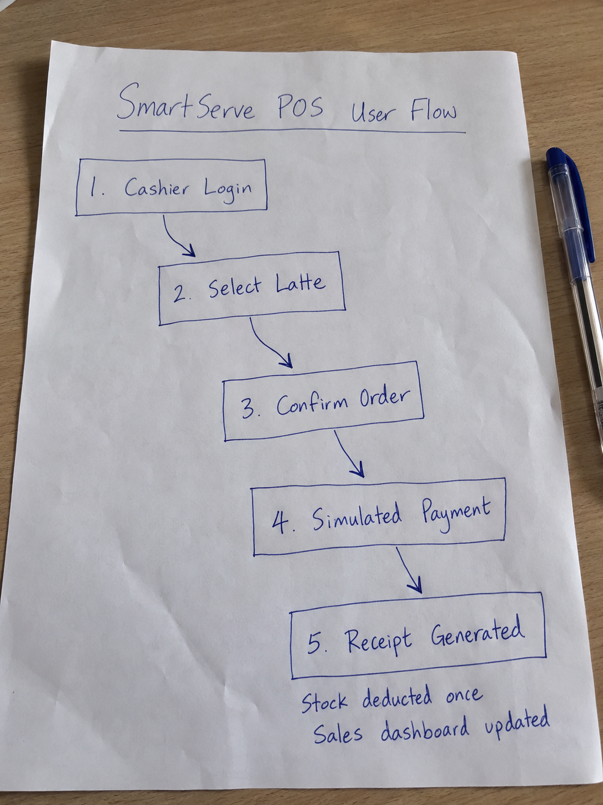

# Design Doc v1

**Team:** Team 3  
**Project name:** SmartServe POS  
**Last updated:** 2026-09-16

## 1. Project Purpose

SmartServe POS is a web application for small cafés and restaurants. It combines menu management, order processing, simulated payments, ingredient inventory, receipts, and daily sales records into one workflow.

Small food businesses may record orders, stock, expenses, and sales in separate places. This makes it difficult to know which ingredients remain available, how much was sold during the day, and whether a completed order was recorded correctly.

## 2. Target Users

| Role | Main responsibilities |
|---|---|
| Administrator or manager | Manage menu items, recipes, ingredients, employees, and view sales records. |
| Cashier | Create customer orders, review totals, process simulated payments, and provide receipts. |

## 3. Smallest Useful Version

The smallest useful version is a web application that supports this complete workflow:

1. An administrator creates an ingredient, a recipe, and a menu item.
2. A cashier selects one or more menu items and creates an order.
3. The system calculates the order total and accepts a simulated payment.
4. The system marks the order as completed and generates a receipt.
5. The system deducts the recipe quantities from inventory exactly once.
6. The system records the sale and displays it in a daily sales view.

### Rough User Flow

`Start → Configure Menu and Ingredients → Create Order → Complete Simulated Payment → Generate Receipt and Update Inventory → Display Sale on Dashboard`

### User-Flow Sketch



## 4. In Scope

- Administrator or manager view for ingredients, recipes, and menu items.
- Cashier view for creating orders and reviewing totals.
- Simulated cash or card payment.
- Receipt generation for completed orders.
- Inventory deduction based on menu-item recipes.
- Daily sales and low-stock dashboard.
- Audit records for inventory deductions.

## 5. Out of Scope

- Real payment-gateway integration.
- Tax reporting and accounting integration.
- Supplier purchasing and delivery management.
- Multiple store branches.
- Customer loyalty programs.
- Mobile applications.
- Advanced forecasting or AI recommendations.

## 6. Midterm Demo Sentence

> Our midterm demo will show a cashier creating a two-latte order, completing a simulated payment, generating a receipt, and verifying that the correct coffee and milk quantities were deducted from inventory and added to the daily sales dashboard.

## 7. Final Demo Sentence

> Our final demo will prove that SmartServe POS can complete a café sale while keeping the order, payment, receipt, inventory, and daily sales records synchronized and preventing duplicate stock deductions.

## 8. MVP Features

| Feature | Required for MVP? | Primary implementation owner | Research, design, or testing support | Issue link |
|---|---|---|---|---|
| Ingredient and recipe management | Yes | Lama Muskan | Ualson Tamang: requirements research | To be added |
| Menu-item management | Yes | Sherap Hyolmo | Shuzita Majhi: interface design and documentation | To be added |
| Cashier order creation | Yes | Lama Muskan | Shuzita Majhi: cashier-view design; Ualson Tamang: workflow research | To be added |
| Simulated payment | Yes | Sherap Hyolmo | Ualson Tamang: payment-flow research | To be added |
| Receipt generation | Yes | Sherap Hyolmo | Shuzita Majhi: receipt layout and documentation | To be added |
| Inventory deduction and audit record | Yes | Lama Muskan | Shreya: test-case preparation and verification | To be added |
| Sales and low-stock dashboard | Yes | Sherap Hyolmo | Shuzita Majhi: dashboard design; Ualson Tamang: reporting requirements research | To be added |
| Manual test cases and verification | Yes | Shreya | Lama Muskan and Sherap Hyolmo: fix implementation defects | To be added |

## 9. Functional Requirements

### Menu and Recipes

- Create, view, update, and deactivate menu items.
- Define the ingredients and quantities required for each menu item.
- Show whether the available stock is sufficient for an order.

### Inventory

- Create and update ingredients with a unit and current quantity.
- Display current stock and low-stock status.
- Record each stock deduction with its related completed order.
- Prevent an order from completing when the required stock is unavailable.

### Orders and Payments

- Add menu items and quantities to an order.
- Calculate the subtotal and total before payment.
- Support a simulated cash or card payment.
- Use clear order states such as `Draft`, `Paid`, `Completed`, and `Cancelled`.
- Prevent duplicate completion of the same order.

### Receipts and Sales

- Generate a receipt containing the order number, items, quantities, total, payment status, and date.
- Record completed sales with enough information to calculate a daily total.
- Display the number of completed orders, total sales, and low-stock ingredients on a dashboard.

## 10. Non-Functional Requirements

- The interface should be simple enough for a cashier to use during a busy shift.
- Inventory and sales updates should remain consistent after a successful payment.
- The system should show validation errors instead of silently accepting incomplete data.
- Demonstration data must be clearly identifiable and must not represent real customer payment information.
- The application should work in a current desktop browser at minimum.

## 11. Core Data Model

| Entity | Important fields | Relationship |
|---|---|---|
| User | id, name, role | Creates or manages orders and records. |
| Ingredient | id, name, unit, quantity, reorder level | Used by one or more recipes. |
| RecipeItem | recipe id, ingredient id, quantity required | Connects a menu item to an ingredient. |
| MenuItem | id, name, price, active status | Has one recipe and can appear in order lines. |
| Order | id, status, subtotal, total, created time, completed time | Contains order lines and one payment record. |
| OrderLine | order id, menu item id, quantity, unit price | Stores the items purchased. |
| Payment | id, order id, method, amount, status, paid time | Records the simulated payment. |
| InventoryTransaction | id, ingredient id, order id, quantity change, time | Audits stock deductions and adjustments. |

## 12. Main Workflow

```text
Cashier selects items
    |
    v
System checks recipe stock and calculates total
    |
    +--> Insufficient stock: show error and keep order open
    |
    v
Cashier confirms simulated payment
    |
    v
System completes order in one controlled operation
    |
    +--> Save payment and completed order
    +--> Deduct each recipe ingredient once
    +--> Save inventory transactions
    +--> Record sale and generate receipt
```
## 13. Risks and Unknowns

| Risk or unknown | Why it matters | Evidence or response |
|---|---|---|
| Duplicate inventory deductions | Repeated payment requests could deduct ingredients more than once. | Use a database transaction, lock the order during payment, and enforce unique database constraints. |
| Partial order completion | A failure could save the payment without updating inventory or sales. | Process the payment, inventory deductions, order status, and sales update in one PostgreSQL transaction. |
| Insufficient stock | A cashier could accept an order that cannot be prepared. | Lock and check the required ingredient rows before completing payment. |
| Scope becoming too large | Additional features could delay the main demonstration. | Prioritize menu, ordering, simulated payment, receipt, inventory deduction, and the basic dashboard. |
| Refund handling | Restoring ingredients after a completed order would require additional transaction logic. | Refunds and completed-order cancellation are outside the midterm scope. |

## 14. Important Uncertainty Check

### Question Checked

Can SmartServe POS update the payment, order, ingredient inventory, inventory audit records, and daily sales as one controlled operation while preventing duplicate deductions?

### Options Considered

| Option | Description | Main benefit | Main concern |
|---|---|---|---|
| Option A: Application-only status check | The backend checks whether the order is already paid before deducting inventory. | Simple to understand and implement. | Two requests arriving at nearly the same time could both pass the status check. |
| Option B: PostgreSQL transaction, row locking, and unique constraints | The database locks the order, performs all related updates in one transaction, and rejects duplicate payment or inventory records. | Provides stronger protection against partial updates and duplicate deductions. | Requires additional database design and transaction handling. |

### Evidence Checked

1. [PostgreSQL Transactions](https://www.postgresql.org/docs/current/tutorial-transactions.html)

   PostgreSQL explains that a transaction combines several database operations into one all-or-nothing operation. If one step fails, none of the changes need to remain.

2. [PostgreSQL Explicit Locking](https://www.postgresql.org/docs/current/explicit-locking.html)

   PostgreSQL supports row-level locks. SmartServe can lock the order and affected ingredient records while payment completion is being processed, preventing two requests from updating the same records simultaneously.

3. [PostgreSQL Unique Constraints](https://www.postgresql.org/docs/current/ddl-constraints.html#DDL-CONSTRAINTS-UNIQUE-CONSTRAINTS)

   PostgreSQL unique constraints prevent duplicate values or duplicate combinations of values. SmartServe can use these constraints to allow only one payment per order and only one inventory-deduction record for each order-and-ingredient combination.

4. [Sherap’s Inventory-Deduction Investigation](https://github.com/CapstoneDesign-Fall2026-UlsanCollege/Team3_CapstoneDesign/issues/2)

   This Issue compares deducting inventory when an order is created against deducting inventory after payment is completed.

### What We Found

The official documentation confirms that PostgreSQL provides the required capabilities:

- Transactions can make the payment, order completion, inventory deduction, audit records, and sales update succeed or fail together.
- Row-level locking can stop concurrent requests from completing the same order at the same time.
- Unique constraints can reject duplicate payment and inventory-deduction records.
- An application-only status check would not provide the same database-level protection against simultaneous requests.

### Decision

Team 3 will use **Option B: PostgreSQL transaction, row locking, and unique constraints**.

Inventory will only be deducted after a simulated payment is successfully completed. The payment and inventory updates will be processed as one controlled database transaction.

### Changes Resulting From This Check

The SmartServe design will include:

- A unique order ID.
- One payment record per order.
- A controlled order-status transition.
- An inventory transaction linked to both the order and ingredient.
- A unique constraint on the payment’s `order_id`.
- A unique constraint on the combination of `order_id` and `ingredient_id` in inventory deductions.
- An order lock while payment is being completed.
- An ingredient-stock check before the transaction is committed.
- A safe response when the same payment request is submitted again.

## 15. Main Risk-Mitigation Design

The system will complete a sale using the following controlled process:

```text
1. Receive the payment request.
2. Begin a database transaction.
3. Lock the selected order.
4. Check whether the order is already paid or completed.
5. Lock and check the required ingredient records.
6. Create one simulated payment record.
7. Deduct each recipe ingredient.
8. Create the inventory audit records.
9. Mark the order as completed.
10. Commit all changes together.
```

If any step fails, the transaction will be rolled back so that the payment, inventory, order, and sales records do not become partially synchronized.

### Database Rules

The planned database will enforce:

```text
UNIQUE (payment.order_id)
```

This prevents more than one payment from being stored for the same order.

```text
UNIQUE (inventory_transaction.order_id, inventory_transaction.ingredient_id)
```

This prevents the same order from deducting the same ingredient more than once.

### Expected Duplicate-Payment Behaviour

If the cashier clicks the payment button twice:

1. The first valid request completes the transaction.
2. The second request finds that the order is already completed.
3. The system returns the existing completed-order result.
4. No additional payment or inventory-deduction record is created.

## 16. Midterm Demonstration Scenario

The team will configure a latte menu item that uses coffee beans and milk.

The demonstration will follow these steps:

1. Display the starting quantities of milk and coffee beans.
2. Create an order for two lattes.
3. Complete a simulated payment.
4. Generate and display the receipt.
5. Display the updated ingredient quantities.
6. Display the completed sale on the daily dashboard.
7. Attempt to complete the same order again.
8. Verify that the second request does not deduct inventory again.

### Expected Inventory Result

For example, if one latte uses `200 ml` of milk and `18 g` of coffee beans, two lattes should deduct:

- `400 ml` of milk
- `36 g` of coffee beans

Repeating the payment request must not create another deduction.

## 17. Evidence Links

### Team Planning Evidence

- [Week 2 Idea Selection Table](./idea-selection-table.md)
- [Week 2 Weekly Report](./weekly-report.md)
- [SmartServe POS User-Flow Sketch](./user-flow-sketch.png)
- [Sherap’s Inventory-Deduction Investigation](https://github.com/CapstoneDesign-Fall2026-UlsanCollege/Team3_CapstoneDesign/issues/2)

### Official Technical Evidence

- [PostgreSQL Transactions](https://www.postgresql.org/docs/current/tutorial-transactions.html)
- [PostgreSQL Explicit Locking](https://www.postgresql.org/docs/current/explicit-locking.html)
- [PostgreSQL Unique Constraints](https://www.postgresql.org/docs/current/ddl-constraints.html#DDL-CONSTRAINTS-UNIQUE-CONSTRAINTS)

### Evidence Summary

The user-flow sketch documents the planned cashier journey. The investigation Issue compares two inventory-deduction approaches. The official PostgreSQL documentation confirms that the selected database supports atomic transactions, row locking, and unique constraints required to prevent partial or duplicate inventory deductions.

## 18. Confirmed Technical Direction

The current planned stack is:

- **Frontend:** React, TypeScript, and Vite
- **Backend:** FastAPI
- **Database:** PostgreSQL
- **Development environment:** Docker Compose

This choice may be reviewed if the team’s implementation investigations identify a major limitation.