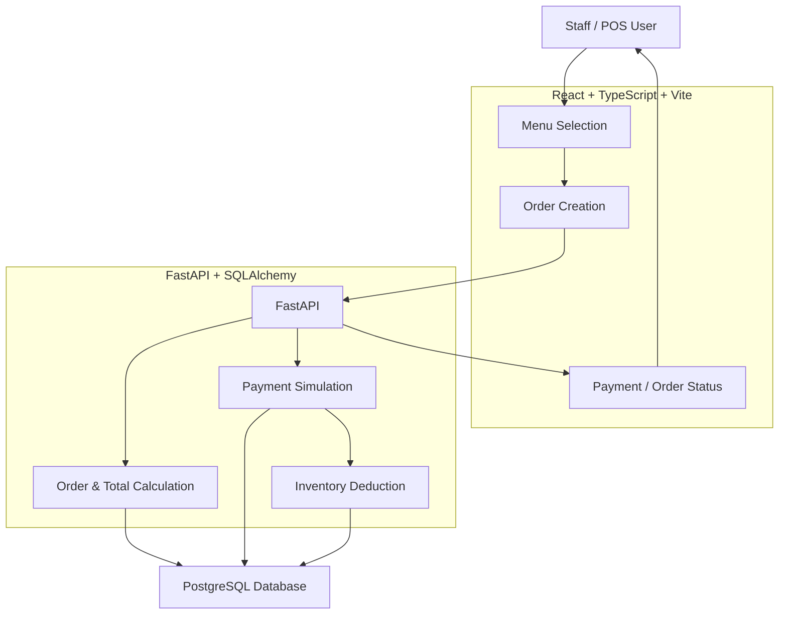

# Architecture Sketch

**Team:** Team 3  
**Project:** SmartServe POS   

**Stack clarification (2026-09-23):** The latest team update confirms FastAPI, matching the [backend implementation](../../smartserve-pos/backend/app/main.py) and [Week 3 stack comparison](tech-stack-comparison.md). The backend uses SQLAlchemy to access PostgreSQL.

**Inventory clarification:** The local Issue #3 update derives `inventory_deducted` from recorded inventory movements. Payment, stock changes, and movement records commit together. See [test results and remaining checks](issue-3-test-results.md).

## One-sentence architecture

SmartServe uses a **React + TypeScript + Vite frontend**, a **FastAPI backend**, **PostgreSQL for persistent data**, and **Docker for consistent development and deployment environments**.

## How the product works

| Step | What happens |
|---|---|
| 1 | Staff selects menu items and quantities from the POS interface. |
| 2 | The frontend sends the selected items and quantities to the FastAPI REST API. |
| 3 | The backend retrieves the stored menu prices and calculates the order total. |
| 4 | The backend creates a unique order and stores the order information. |
| 5 | The user simulates payment for the order. |
| 6 | The backend changes the order status to `paid`. |
| 7 | After successful payment, the backend deducts the required recipe ingredients from inventory. |
| 8 | The system uses `inventory_deducted` to prevent the same order from deducting inventory more than once. |
| 9 | The frontend displays the order status and result to the user. |

## System diagram



## Main parts

| Part | What it does | Owner | Risk / uncertainty |
|---|---|---|---|
| Menu Selection | Allows the user to select menu items and quantities. | Lama Muskan | Menu and quantity data must be sent correctly to the backend. |
| Order Creation | Creates a unique order and stores the selected items and quantities. | sherap | Order data must remain consistent between frontend and backend. |
| Order Total Calculation | Calculates the total using the stored menu prices rather than trusting a frontend total. | Lama Muskan | Incorrect price or quantity handling could produce an incorrect total. |
| Payment Simulation | Simulates a successful payment and changes the order status to `paid`. | Ualson | Payment and order status must remain consistent. |
| Recipe / Inventory | Deducts the required recipe ingredients after successful payment. | Sherap | Incorrect recipe data could cause incorrect inventory deductions. |
| Duplicate Prevention | Uses `inventory_deducted` to prevent inventory from being deducted more than once. | Lama Muskan | Duplicate requests could cause inventory to be deducted multiple times if not handled correctly. |
| Database | Stores menu items, prices, orders, order items, recipes, and inventory data. | Sujita | Database relationships and transactions must remain consistent. |
| FastAPI | Connects the frontend with the backend and handles order, payment, and inventory operations. | Shreya | API validation and error handling need to be implemented correctly. |

## Data flow for the vertical slice

```text
Menu Items + Quantities
          |
          v
     Create Order
          |
          v
 Stored Menu Prices
          |
          v
    Calculate Total
          |
          v
   Unique Order ID
          |
          v
   Simulate Payment
          |
          v
     Status = paid
          |
          v
 Deduct Recipe Ingredients
          |
          v
 inventory_deducted = true
```

## Technology stack

| Layer | Technology | Purpose |
|---|---|---|
| Frontend | React + TypeScript + Vite | POS interface and user interaction |
| Backend | FastAPI | Server-side application logic |
| API | FastAPI REST endpoints | Communication between frontend and backend |
| Database | PostgreSQL | Persistent storage for menu, orders, recipes, and inventory |
| Containerization | Docker | Consistent development and deployment environment |
| Version Control | Git + GitHub | Source control and team collaboration |

## Evidence links

- Architecture diagram: this document
- Candidate Vertical Slice: [candidate-vertical-slice.md](candidate-vertical-slice.md)
- Tech Stack Comparison: [Week 3 Stack Comparison](tech-stack-comparison.md)
- GitHub Issues: [Issues Board](https://github.com/CapstoneDesign-Fall2026-UlsanCollege/Team3_CapstoneDesign/issues)
- Wireframes: [screen descriptions and three sketches](wireframe-notes.md).

## Important decisions

| Decision | Why | Risk |
|---|---|---|
| React + TypeScript + Vite for frontend | Provides a modern frontend structure suitable for a POS interface and supports TypeScript type safety. | Team needs to maintain clear frontend/backend API boundaries. |
| FastAPI + SQLAlchemy | Provides backend logic and a REST API for communicating with the frontend. | API design and validation need to be implemented consistently. |
| PostgreSQL | Suitable for relational data such as menu items, orders, order items, recipes, and inventory. | Database relationships need to be designed correctly. |
| Backend calculates the order total | Prevents the frontend from being the source of truth for menu prices. | Backend must retrieve the correct stored menu prices. |
| Inventory deducted after successful payment | Prevents inventory from being deducted for unpaid orders. | Payment and inventory operations must be handled reliably. |
| `inventory_deducted` flag | Prevents duplicate inventory deduction for the same order. | The flag must be checked and updated correctly. |
| Docker | Provides a consistent environment for team members and project services. | Docker configuration must remain synchronized across the team. |

## What could break?

- The frontend could send incorrect menu item IDs or quantities.
- The backend could calculate an incorrect total if stored menu prices are not retrieved correctly.
- An order could be marked as `paid` without correctly triggering inventory deduction.
- Inventory could be deducted twice if duplicate payment requests are not handled correctly.
- Recipe data could be missing or incorrect for a menu item.
- Database transactions could fail halfway through the payment and inventory process.
- Frontend and backend API contracts could become inconsistent.
- Docker configuration could differ between team members' environments.
