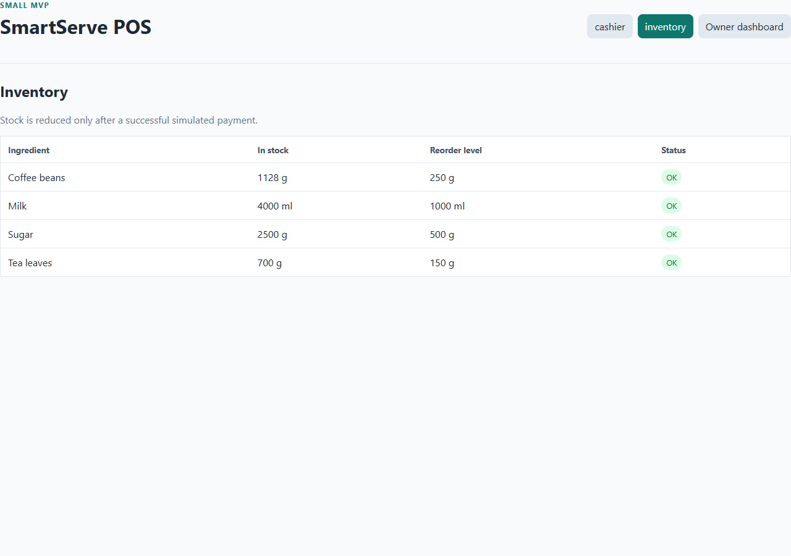
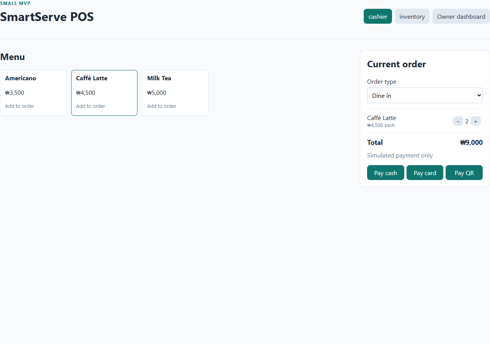
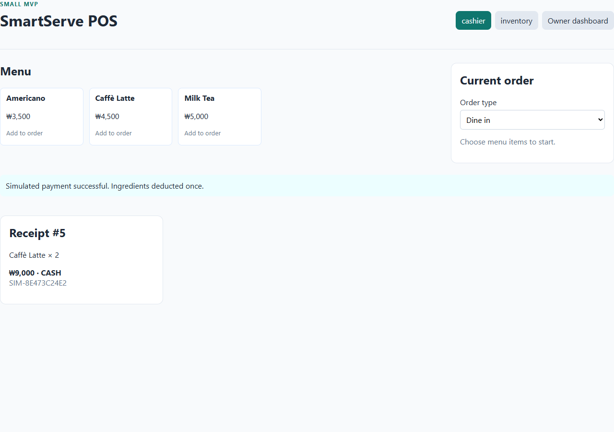
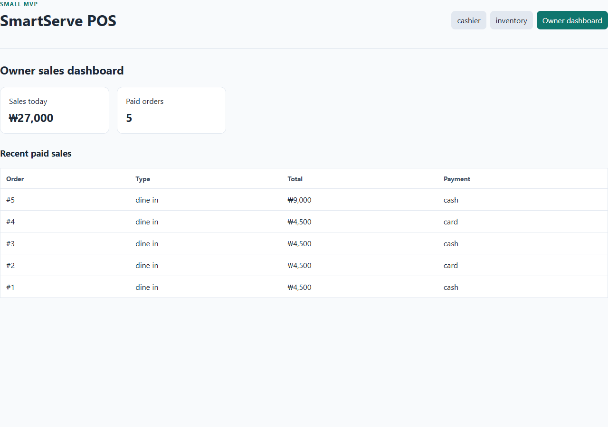

# Two-Latte demo evidence

Run: 2026-09-23T07:07:07.976Z

Performed by browser automation using browser automation against the isolated SmartServe test instance. Shuzita has not yet personally reviewed or reproduced this run.

Order **#5**: two Lattes, **KRW 9,000**, paid by simulated cash.

| Check | Before | Expected after | Actual after | Result |
|---|---:|---:|---:|---|
| Milk (ml) | 4000 | 3500 | 3500 | PASS |
| Coffee beans (g) | 1128 | 1092 | 1092 | PASS |
| Paid orders | 4 | 5 | 5 | PASS |
| Sales (KRW) | 18000 | 27000 | 27000 | PASS |

## Evidence files

[Raw results](results.json) · [Capture script](capture.cjs)

### 01-inventory-before

### 02-sales-before

### 03-two-latte-order

### 04-receipt

### 05-inventory-after

### 06-sales-after

## Personal review pending

Shuzita should compare these screenshots and recorded values, note any findings, and personally add her actual review or reproduction contribution to the shared report. This evidence does not claim that she performed the automated run.
