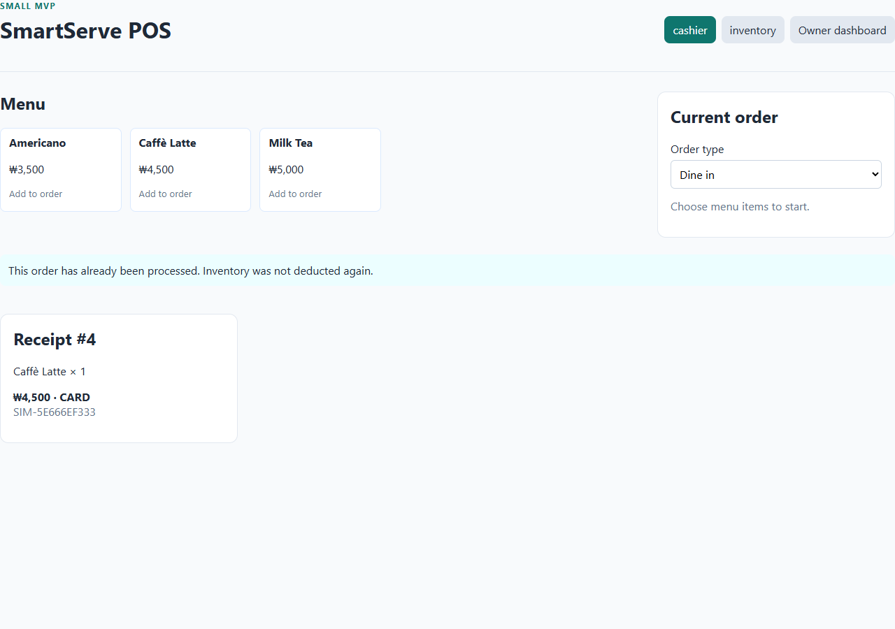

# Issue #3 — Payment and inventory verification

Date: 2026-09-23

[GitHub Issue #3](https://github.com/CapstoneDesign-Fall2026-UlsanCollege/Team3_CapstoneDesign/issues/3) · [Week 3 index](../../README.md) · [Weekly Report](../../weekly-report.md)

Prepared for Team 3 / `daydevil80`. The initial unit-test evidence was pushed in commit `67cf5d0`. The live verification below was completed locally on 2026-09-23. Its results and screenshots are included alongside this report; attaching their links to Issue #3 remains pending.

## Implementation

- Orders already have unique database primary keys.
- A failed simulated payment (`result: "failed"`) returns HTTP 402 without changing stock or creating a completed payment. The order stays open for retry.
- A successful simulated payment marks the order paid and commits the payment, ingredient deductions, and inventory movement records together.
- `inventory_deducted` is checked before deduction and returned in the order response. It is derived from the durable inventory movement ledger rather than a separate Boolean column that could drift out of sync.
- An already paid order or an order with existing deduction records returns HTTP 409: “This order has already been processed. Inventory was not deducted again.”
- The existing order row lock and unique constraints remain in place. Ingredient locks are acquired in ID order.
- The cashier blocks overlapping Pay clicks and retains the pending order ID in session storage. A payment retry after refresh uses that order. An already paid response retrieves the existing receipt.

## Automated backend results

Test source: [test_issue3.py](../../../../smartserve-pos/backend/test_issue3.py).

Executed with Python 3.12, FastAPI 0.115.8, SQLAlchemy 2.0.38, and an isolated SQLite database. No application data was changed.

| Test | Result |
|---|---|
| Failed payment leaves stock unchanged, creates no payment/movements, and allows retry | PASS |
| Insufficient milk rejects payment without stock/payment/movement changes | PASS |
| One Latte deducts 250 ml milk and 18 g beans; a duplicate in a new session returns 409 with no additional deductions | PASS |
| Existing ledger records prevent another deduction even if order status is inconsistent | PASS |
| Two created orders receive different IDs | PASS |

The Latte test also verifies two recorded ingredient movements, their quantities, timestamps, and order ID; exactly one completed payment remains after retry.

```text
Ran 5 tests in 0.089s
OK
```

To rerun with backend dependencies installed, from `smartserve-pos/backend`:

```text
python -B -m unittest -v test_issue3
```

The test module forces an isolated SQLite database and recreates only that in-memory database.

## Frontend verification

`npm ci` and `npm run build` passed (TypeScript and Vite production build). The build emitted a nonblocking Vite configuration module-format warning.

## Live PostgreSQL and browser verification — 2026-09-23

The isolated Docker Compose project `smartserve-issue3` ran the actual FastAPI service against PostgreSQL 16. Chromium exercised the actual React frontend. Normal application data was not used.

| Check | Actual result | Status |
|---|---|---|
| Ten simultaneous payment requests for one Latte order | One HTTP 200, nine HTTP 409 responses; milk decreased 250 ml and beans 18 g in total | PASS |
| Failed simulated payment, then retry | HTTP 402, unchanged stock, and `inventory_deducted=false`; retry succeeded with one recipe deduction | PASS |
| Three rapid Pay clicks | Exactly one order created; one recipe deduction and one receipt | PASS |
| Refresh after payment commits but before its response reaches the browser | Saved order ID reused; HTTP 409 displayed safely; original receipt recovered; stock deducted only once | PASS |
| PostgreSQL payment and movement records | Each of the four tested orders has exactly one payment and two ingredient movements | PASS |

Evidence: [machine-readable results](live-results.json), [repeatable test script](verify.cjs), [rapid-click screenshot](screenshots/paid-once.png), and [refresh/retry screenshot](screenshots/refresh-retry.png).



To repeat, start a separate test instance with `docker compose -p smartserve-issue3 up -d --build db api` from `smartserve-pos`, then start the frontend with `npm run dev -- --host 127.0.0.1`. Run `node docs/week-03/issues/issue-03/verify.cjs` from the repository root with Playwright available. `PLAYWRIGHT_MODULE` and `CHROMIUM_PATH` can point to an existing Playwright installation and Chromium executable. The test creates and pays four demo orders, so use only the isolated test instance with sufficient seeded stock.

## Definition of Done status

- [x] Payment completion deducts the correct recipe ingredients.
- [x] Duplicate deduction is prevented in the tested concurrent, rapid-click, and refresh scenarios.
- [x] Inventory deduction is recorded in PostgreSQL.
- [x] Latte test passes: 250 ml milk and 18 g beans per Latte.
- [ ] Attach the new screenshots or test results to GitHub Issue #3 after publishing these evidence files.

No GitHub issue was updated or closed during this verification.

## Suggested issue update

Issue #3 verification passed: one Latte deducts 250 ml milk and 18 g beans exactly once. Ten simultaneous payments produced one success and nine safe duplicate errors. Failed payment leaves inventory unchanged. Rapid clicks create one order, and refresh/retry recovers the original receipt without another deduction. PostgreSQL confirms one payment and two ingredient movements per tested order. Five backend unit tests and the frontend build also passed. Attach the test-results and screenshot links here before closing.
