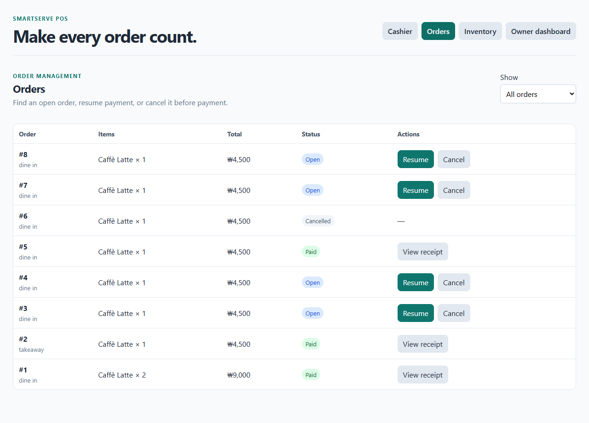
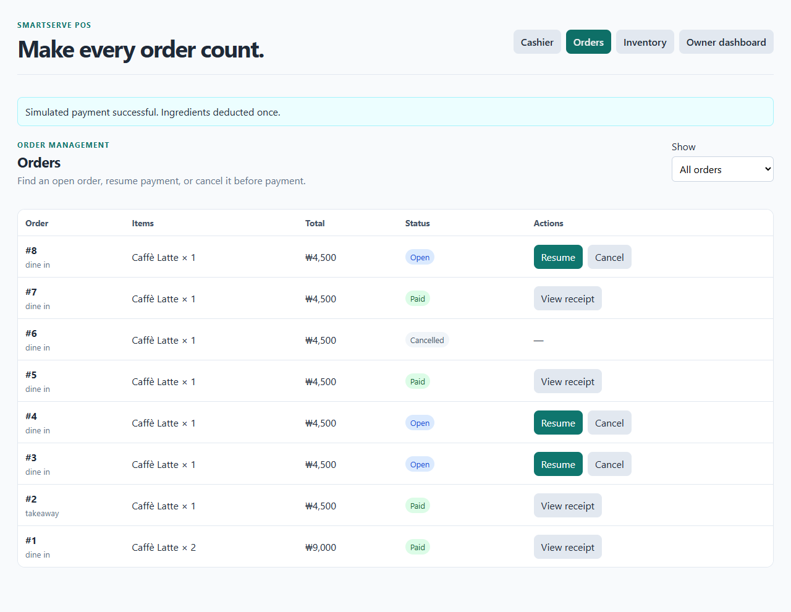
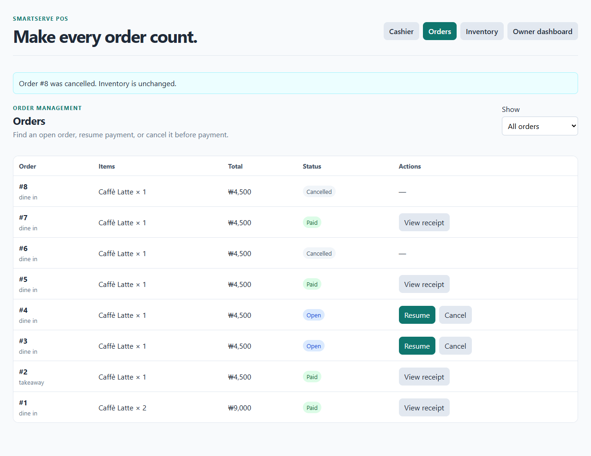

# Orders screen verification

On 2026-10-01, Codex ran the [repeatable browser check](verify.cjs) against an isolated SmartServe Docker frontend, FastAPI API, and PostgreSQL database. The assigned student has not claimed personal execution.

The Orders screen listed open orders, resumed one Latte order for payment, and changed it to `paid`. A second open Latte order was cancelled from the list. Payment of that cancelled order returned HTTP 409. Across both orders, inventory fell by only **250 ml milk and 18 g coffee beans**, while paid-order count rose by **one** and sales by **KRW 4,500**. The cancelled order added no stock deduction or sale. [Machine-readable result](results.json).

The frontend production build and all eight backend unit tests passed. The unit tests include cancellation after payment, rejection of payment after cancellation, and the existing duplicate-payment and inventory checks.
