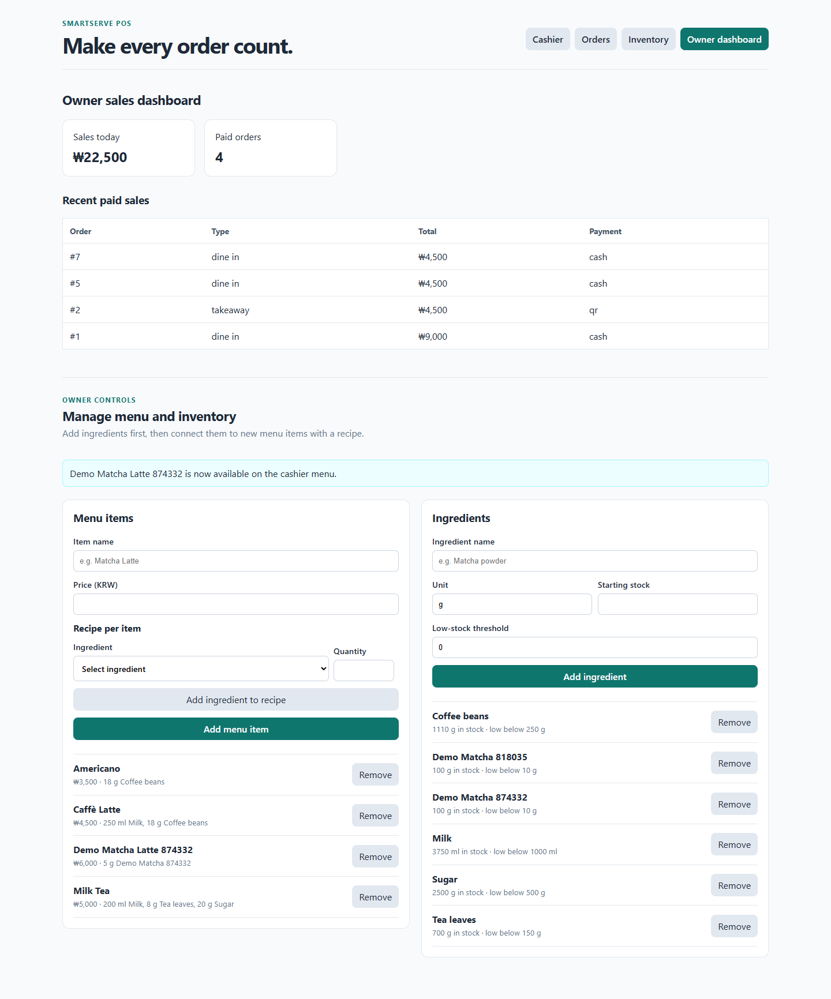
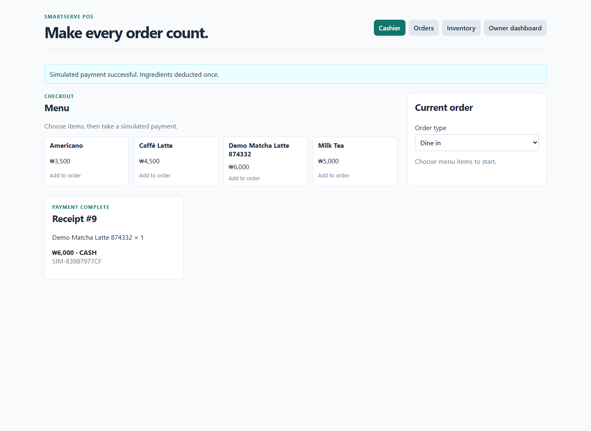
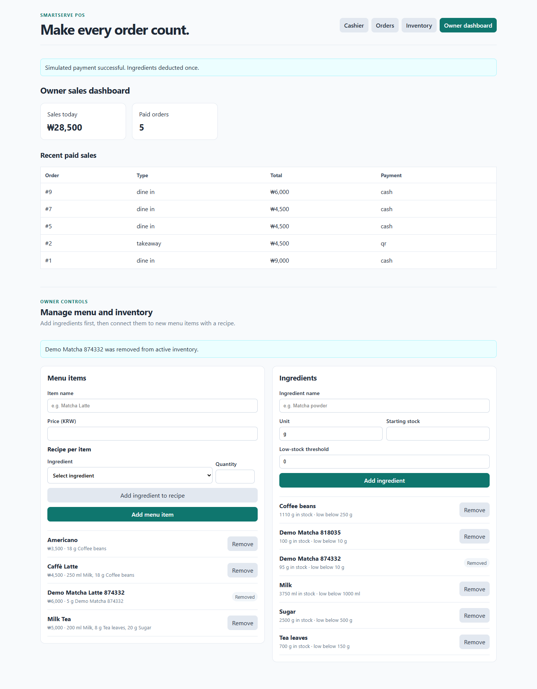

# Owner menu and inventory controls

On 2026-10-01, The automated runner ran the [browser check](verify.cjs) against the isolated SmartServe Docker frontend, FastAPI API, and PostgreSQL database. The run added an ingredient with 100 g stock, created a menu item with a 5 g recipe, sold one item, and verified stock fell to 95 g. It then removed the menu item and ingredient from active use. The cashier menu and inventory list no longer showed them, while the paid order's receipt remained readable. [Machine-readable result](results.json).

The frontend production build and 11 backend unit tests passed. The tests cover recipe deduction, preservation of historical receipts, duplicate names, inactive ingredients, and refusal to remove an ingredient used by an active menu item or open order.

These controls are available in the Owner view, but the MVP still has no login or role-based authorization. Access restriction is a separate feature before real deployment.
