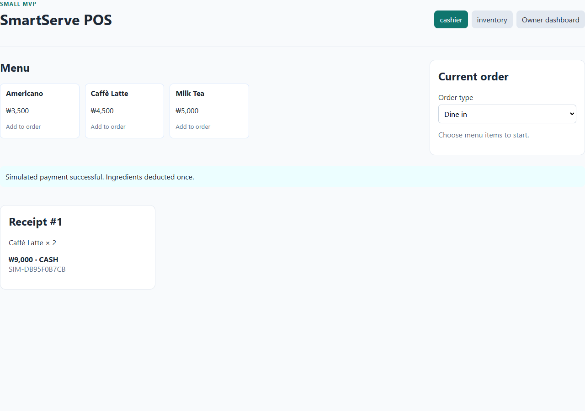
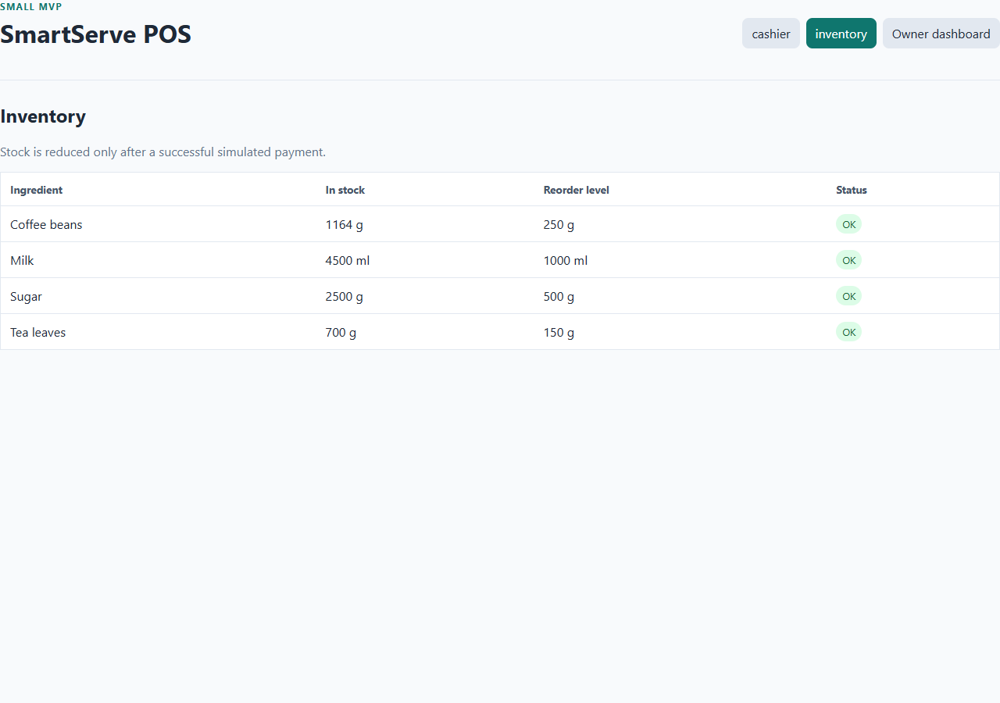
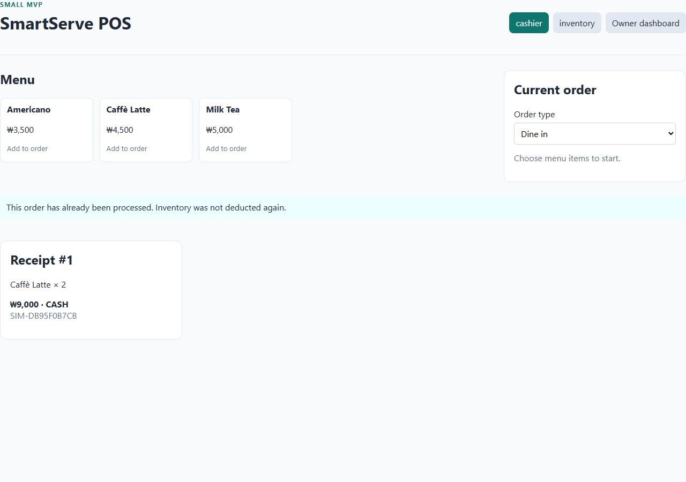
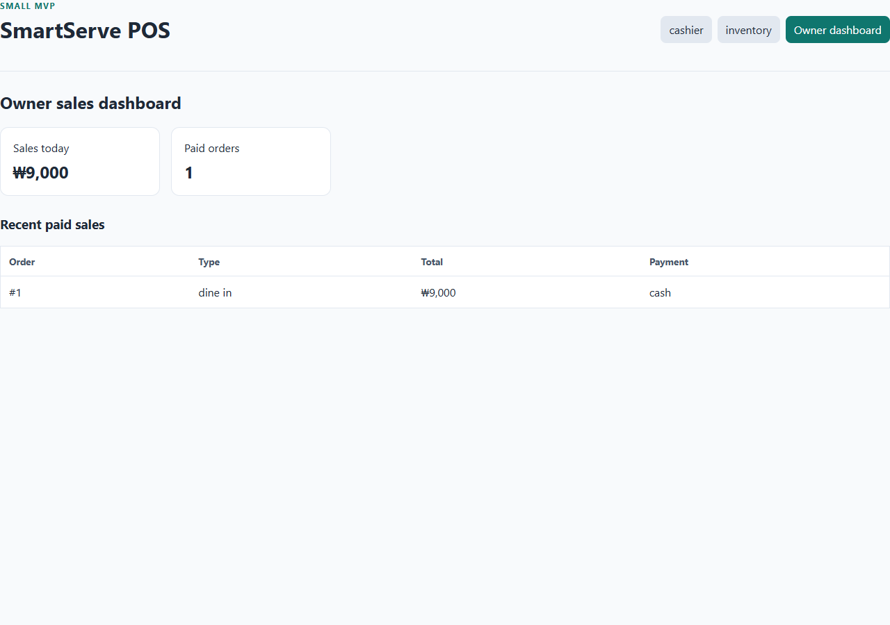

# Live Docker payment and inventory test evidence

Run: 2026-10-01. Environment: isolated `smartserve-payment-check` Docker Compose project with the actual SmartServe frontend, FastAPI backend, and PostgreSQL database. This was a Automated browser run, not a personal execution by the assigned student.

Two Lattes were purchased on order **#1** for **KRW 9,000**. The same order ID was then submitted for payment again through the cashier UI.

| Check | Before | After first payment | After repeated payment | Result |
|---|---:|---:|---:|---|
| Payment HTTP status | — | 200 | 409 | PASS |
| Order status | open | paid | paid | PASS |
| Milk (ml) | 5000 | 4500 | 4500 | PASS |
| Coffee beans (g) | 1200 | 1164 | 1164 | PASS |
| Paid orders today | 0 | 1 | 1 | PASS |
| Sales today (KRW) | 0 | 9000 | 9000 | PASS |

The repeated request displayed: “This order has already been processed. Inventory was not deducted again.” The original receipt remained visible. A PostgreSQL query confirmed **one payment** and **two inventory movements** for order #1: milk **−500 ml** and coffee beans **−36 g**.

[Raw API results](results.json) · [Repeatable capture script](capture.cjs)

## Screenshots from the running app

To repeat this run, start the isolated Docker project from `smartserve-pos` with `docker compose -p smartserve-payment-check up -d --build`, then run `node docs/week-04-chuseok/payment-test-evidence/capture.cjs` from the repository root with Playwright and Chromium available. The script creates and pays a new two-Latte order in that isolated database.
