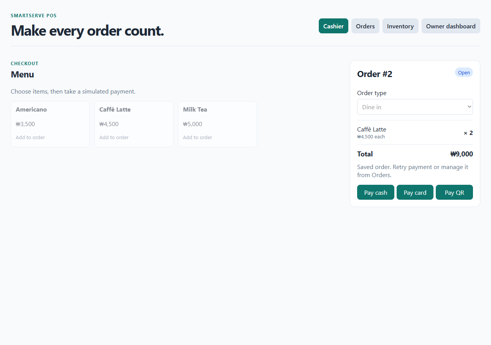
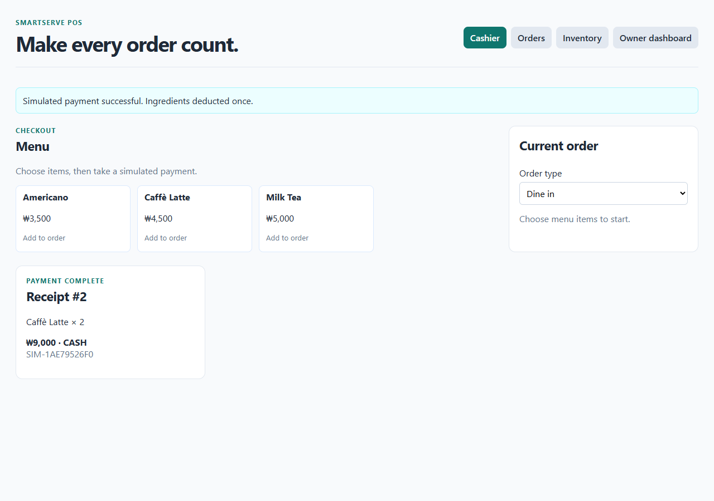

# Week 5 cashier/order evidence

**Contribution account:** `daydevil80`  
**Checked:** October 7, 2026, 14:28 Korea time  
**Base:** `smartserve-mvp` at `8f4bc74`, after pulling teammate updates  
**Publication:** New implementation/report changes are local and not yet committed or pushed.

## Change

Added a separate **Create order** button. The cashier can select quantities, save an unpaid order, inspect its saved total, refresh, and pay that same order later. The existing Pay buttons still support direct checkout. Creation failure keeps the cart available for retry; saved-order loading failures show a message.

The API uses `open` for an unpaid order. This is the current equivalent of the proposed `pending` stage in Issue #19. This contribution does not rename the database state. The saved unit price and recipe-stock transaction already existed; this update makes order creation visible as its own cashier action.

## Actual verification

| Check | Expected | Observed |
| --- | --- | --- |
| Simulated API creation outage | Error shown; cart retained for retry | PASS; two-Latte cart remained ₩9,000 |
| Create two-Latte order | HTTP 201; `open`; 2 × ₩4,500 = ₩9,000 | PASS; order #2 |
| Before payment | Stock and paid-order count unchanged | PASS |
| Refresh | Same saved order and total recovered | PASS |
| Cash payment | Same order becomes paid and shows receipt | PASS |
| Recipe deduction | Milk −500 ml; coffee beans −36 g | PASS |
| Duplicate payment | HTTP 409; stock unchanged | PASS |
| Sales | One paid order and ₩9,000 added | PASS |
| Backend regression checks | Existing order/payment tests pass | 8 tests passed |
| Frontend production build | TypeScript and Vite complete | PASS; nonblocking existing Vite config warning |

[Machine-readable result](results.json), [browser check source](verify-cashier.cjs), [cashier implementation](../../smartserve-pos/frontend/src/main.tsx).





The first browser-check attempt timed out because its exact-text locator included the unit-price child text. The locator was corrected; the complete rerun above passed. That first attempt left unpaid order #1 in the isolated demo database. Order #2 is the successful run. Screenshots/data use sample records only.

## Reproduce

Requirements: Docker Desktop running with Linux containers; ports 5432, 8000 and 5173 available. From the repository root:

```powershell
Set-Location smartserve-pos
docker compose -p smartserve-week5-check up -d --build
docker compose -p smartserve-week5-check exec -T api python -m unittest -v test_issue3
npm --prefix frontend run build
```

Open `http://localhost:5173`. Select Caffè Latte twice, click Create order, and check the unpaid order/₩9,000 total. Refresh and pay cash. Check Inventory and Owner dashboard against their starting values. For repeatable automation, use Node.js plus Playwright with an installed browser:

```powershell
Set-Location ..
# Optional: set PLAYWRIGHT_MODULE to an existing Playwright module path.
# Optional: set CHROMIUM_PATH to an installed compatible browser executable.
node docs/week-05/verify-cashier.cjs
```

The script creates/pays sample orders and overwrites this folder's results/screenshots. Run only against a dedicated demo database with the seeded Latte price. The Compose project above uses its own named volume; do not run it alongside another project using the same host ports. Stop this demo without deleting data using `docker compose -p smartserve-week5-check stop` from `smartserve-pos`.

## Remaining work and scope

Payment is simulated and no money is charged. Menu and inventory are seeded sample data; database persistence and ingredient ledger updates are real local software operations. PostgreSQL connectivity succeeded in this Docker environment; another teammate's setup has not been verified.

`daydevil80` next action: review this change, commit/push the intended files, and add the actual GitHub commit/PR link to the report. Other members must confirm their own contribution rows and proposed task ownership. Independent teammate reproduction remains pending; a local automated run does not satisfy that check.
