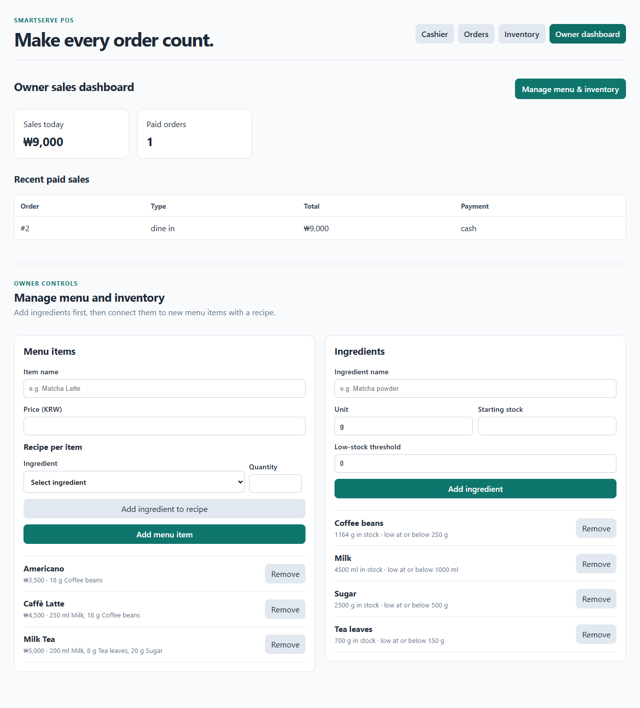
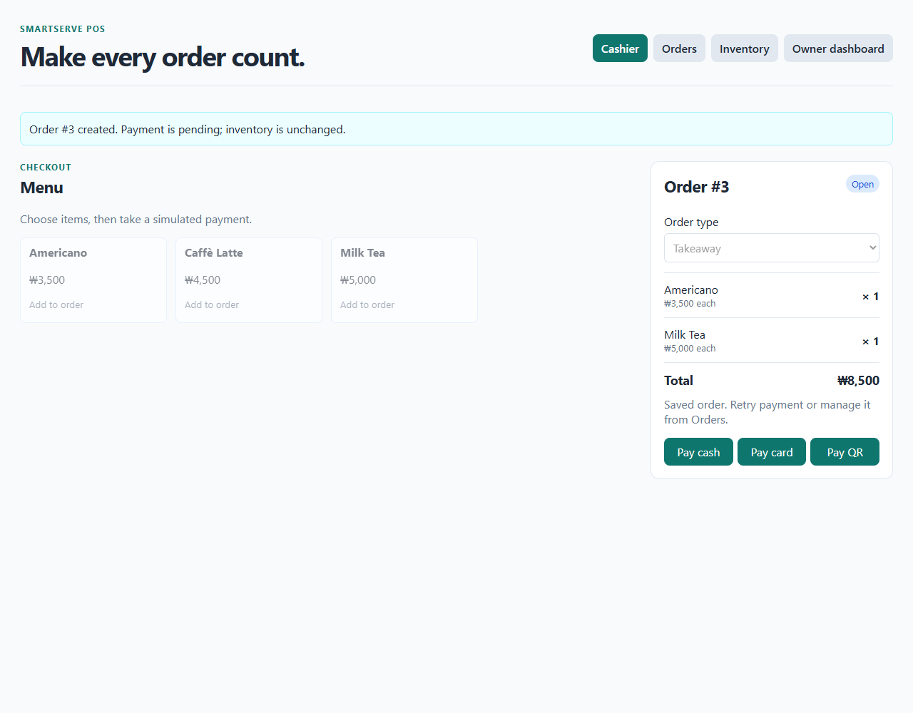
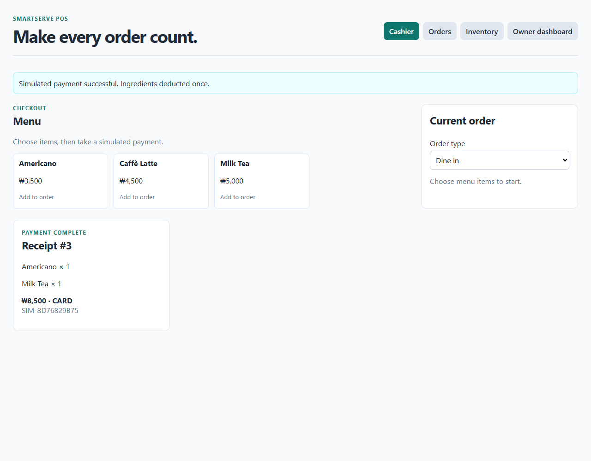
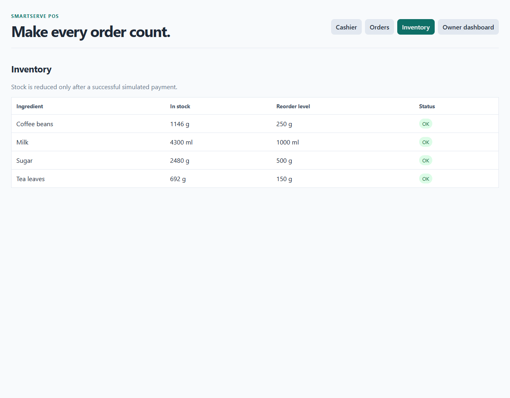
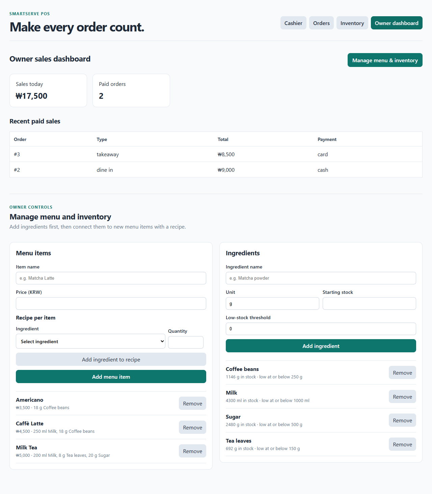

# Receipt and inventory evidence — shuzita-ben

Prepared for Shuzita's Week 5 review. **Provenance:** Automated browser/API test on the existing development PC. Shuzita's personal review and independent reproduction are pending. No GitHub changes were made by this run.

## Verified run

October 7, 2026, 14:56 Korea time; software commit `a36f83a`. Order #3: one Americano and one Milk Tea, takeaway, simulated card payment, ₩8,500. The checks passed for order/receipt contents, refresh recovery, unchanged unpaid inventory, correct ingredient deductions, one additional sale, and a rejected duplicate payment without additional stock or sales changes.

[Complete actual results and pasteable Issue #18 comment](issue-18-comment.md)

[Machine-readable results](results.json) · [Repeatable test script](verify.cjs)

## Screenshots












## Reproduce

Use a dedicated demo environment, with seeded menu prices and sufficient stock. This script creates and pays sample orders and overwrites its results/screenshots. Ensure the API at localhost:8000 and frontend at localhost:5173 belong to the same demo Compose project.

From the repository root:

```powershell
Set-Location smartserve-pos
docker compose -p smartserve-week5-check up -d --build
Set-Location ..
# Set PLAYWRIGHT_MODULE if Playwright is installed outside normal Node resolution.
# Set CHROMIUM_PATH to an installed compatible browser, if needed.
node docs/week-05/shuzita-ben/verify.cjs
```

Node.js, Playwright, Docker Desktop Linux containers, and a compatible Chromium browser are required. Inventory/sales comparisons use values captured immediately before and after the test, rather than assuming a fresh database. Avoid concurrent sales during the check.

The first automation attempt timed out on an exact-label selector for order type before creating an order. The selector was corrected to the cashier's select element; the complete rerun passed. This was a test-selector issue, not a demonstrated application failure.

## Personal contribution follow-up

Shuzita can review the supplied receipt/inventory evidence and record her own findings, or independently run the app and capture new evidence. Uploading this package alone does not demonstrate her personal review or a second-PC run. Do not check off Issue #18's full two-Latte reproduction based on this mixed-order automated test.
